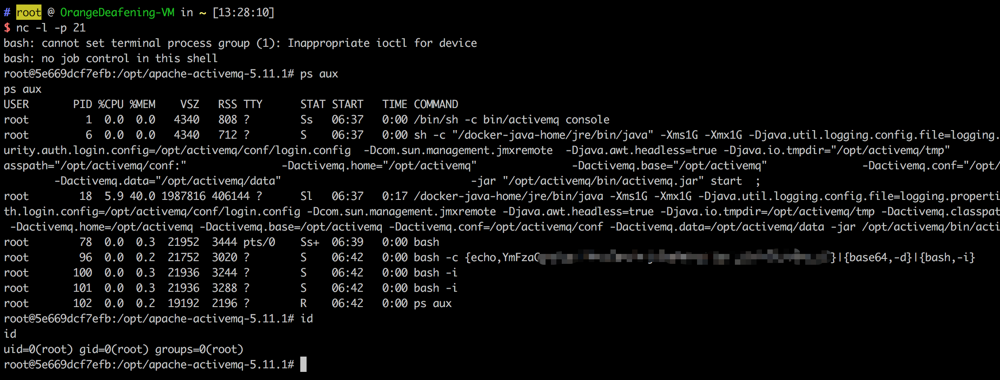

# ActiveMQ Deserialization Vulnerability (CVE-2015-5254)

[中文版本(Chinese version)](README.zh-cn.md)

Apache ActiveMQ is an open source messaging middleware developed by the American Pachitea (Apache) Software Foundation that supports Java messaging services, clustering, Spring framework, and more.

Apache ActiveMQ version 5.x before the 5.13.0 security vulnerability, the vulnerability caused by the program does not limit the classes that can be serialized in the proxy. Remote attacker can make a special serialized Java Message Service (JMS) ObjectMessage objects exploit this vulnerability to execute arbitrary code.

Reference Links:

- https://www.blackhat.com/docs/us-16/materials/us-16-Kaiser-Pwning-Your-Java-Messaging-With-Deserialization-Vulnerabilities.pdf

## Vulnerability environment

Start the vulnerable environment:

```
docker-compose up -d
``` 

After running the environment, it will establish two ports on port 61616 and 8161. Port 61616 is the working port, and messages are delivered on this port. Port 8161 is the webpage management page port. Access ` http://your-Ip:8161`, You can see the network management page, but this vulnerability does not require a network theoretically.

## Exploit

The exploit process is as follows:

1. Generate serialized payload (u can using ysoserial)
2. send payload to port 61616
3. Access the web management page and read the serialization messages, then u can trigger vulnerability.

To exploit this environment we will use [jmet](https://github.com/matthiaskaiser/jmet) (Java Message Exploitation Tool). First download the jar file of jmet, and create an external folder in the same directory (otherwise it may occur the error that the folder does not exist).

the jmet is to use ysoserial to generate Payload and send it (the jar comes with ysoserial, we don't no need to download it again), so we need to choose one that can be used in ysoserial as the gadget, such as ROME.

Execute:

```
java -jar jmet-0.1.0-all.jar -Q event -I ActiveMQ -s -Y "touch /tmp/success" -Yp ROME your-ip 61616
``` 


At this point, a queue named event will be added to the target ActiveMQ. 

You can visit `http://your-ip:8161/admin/browse.jsp?JMSDestination=Event` to see all messages in this queue 

( __login / password:__  admin / admin ):


Click this message to trigger the command execute, this time into the container `docker-compose exec activemq bash`, 

we can see /tmp/success has been successfully created, indicating exploit successful:


Replace the command with a reverse shell statement and reuse it:



It's worth noting that accessing messages through the web administration page and triggering the vulnerability requires administrator privileges. In the absence of password, we can induce administrator visit our link to trigger, or disguised as legitimate messages from other services need to wait for client access when triggered.
